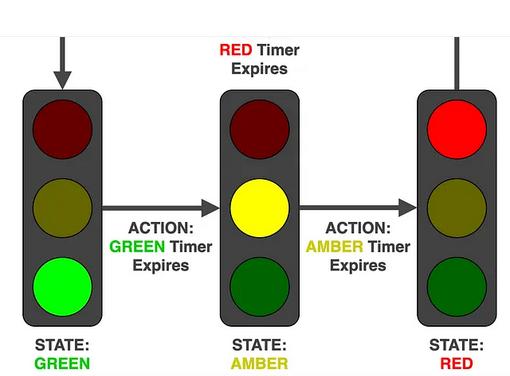

# EFPSE Finite State Machine tutorial {#efpse-finite-state-machine-tutorial}

This is the first tutorial of the EFPSE Finite State Machine.

## Intro {#intro}

### Who is this document for? {#who-is-this-document-for}

Users of EFPSE that are Somewhat familiar with the software. IE: You should know how to navigate efpse, Add textures, Create new maps and do simple tasks.

### What are the assumptions? {#what-are-the-assumptions}

I assume you know what a computer is and that's pretty much it.

### who is the author? {#who-is-the-author}

me

### Structure of document {#structure-of-document}

First half lecture blah blah

Second half implementation and application of blah blah

## First half (lecture blah blah) {#first-half-lecture-blah-blah}

### What is a finite state machine? {#what-is-a-finite-state-machine}

> A state machine \[🤖\] reads a set of \[⏰:🕓\] inputs and changes to a different state\[🚦:🟥,🟨,🟩\] based on those inputs.

~[and an even more technical definition Is available here](https://developer.mozilla.org/en-US/docs/Glossary/State_machine)🤓~

Ok, but what does that quote really mean?

If you've never heard of a finite state machine before you may picture some kind of robot that's... finite? Let's try to see if we can fill in some more details of this finite fuzzy robo we're photoing in our mind. In fact they don't even need to be a robot at all!

Really all we need is a pencil and paper but since this is a computer I'll make a little diagram.


So we draw two circles that represent two different `states` and we draw an arrow between them to represent the `input` . The text over the arrow that reads `Go to STATE B`, that's our `input` or our `action`. If we give that `input` or `action` to our machine, then our state machine will transition into `STATE B`.

### Huh? Break it down for me {#huh-break-it-down-for-me}

It can be kind of hard to see what's going on in a diagram like this so let's break it down into three steps.

In the very zeroth step we have our machine represented by this little box in `STATE A`

#### 

Now we give our machine the signal to go to `STATE B`


And upon receiving this signal the machine will change the `STATE B` and that's where it will stay


OK admittedly that was kind of abstract, so let's look at some real world examples that we've already interacted with.

### Everyday examples {#everyday-examples}

That's right, you've interacted with state machines plenty of time and probably even multiple times today!

-   Light switches (🔛:💡,📴:⬛)
-   Traffic lights (🚦:🟥,🟨,🟩)
-   Brushing teeth (🤔)

### A closer look (👀)

#### At light switches: {#at-light-switches}

{width="350"}

#### At traffic lights: {#at-traffic-lights}

{fig-alt="Traffic light diagram explaining how as the timer expires the traffic light transitions from green to amber to red and emback the green" fig-align="left"}

<iframe src="https://stately.ai/registry/editor/embed/f7a50bc1-d70b-4133-823c-4f7370e0ea70?machineId=59c79808-2046-49e6-8124-347988a3fda6" width="80%" height="400px" frameborder="0">

</iframe>

[Traffic light state machine simulation using stately](https://stately.ai/registry/editor/f7a50bc1-d70b-4133-823c-4f7370e0ea70?mode=Design&machineId=8757d2cb-9c54-48be-a3f9-651bcd921054)

#### Brushing Teeth {#brushing-teeth}

{width="500"}

### How do you create a state machine (In EFPSE 1.10.4)?

#### Overview {#overview}

📂Project/States/Decoration.states

``` states
image Decoration 0 4

state IDLE NONE 0
frame 0 0.25 0 0 0 NONE
frame 0 0.25 0 0 0 READY

state DEATH DEAD 0
frame 1 0.166 0 0 0 NONE
frame 2 0.166 0 0 0 NONE
frame 3 0.166 0 0 0 NONE

state DEAD NONE 0
frame 4 0.25 0 0 0 NONE
frame 4 0.25 0 0 0 NONE
```

{width="650"}

#### Syntax {#syntax}

Let's break this down by taking a look at each line and identify what's going on.

##### Resource declarations {#resource-declarations}

`image Decoration 0 4`

All resource declarations need to be done at The top of the file. This can include `image`s using the `image` keyword or `sound`s using the `sound` keyword (Which will be covered later). 

##### State declarations {#state-declarations}

`state IDLE NONE 0`

Each `state` definition is preceded by the keyword `state` then followed by the `NAME` of the `state` you would like to define followed by the `NAME` of the `state` you would like to come after. The end of this line it needs a zero and this is an interpolation flag for 3D models.

~That is correct you can use 3D models but we will not be covering that in this tutorial.~

##### Frame declarations {#frame-declarations}

``` state
state IDLE NONE 0
frame 0 0.25 0 0 0 NONE
frame 0 0.25 0 0 0 READY
```

Each line of the `state` begins with the keyword `frame` followed by the frame number (`0`) followed by duration the frame will be displayed (`0.25`), followed by XYZ offsets for weapons (`0 0 0`), followed by an action where default is the keyword `NONE`

Let's take an even closer look at one of these `frame` declarations.

<table>
  <tr>
    <th><span style="color: blue; font-weight: bold;">Frame keyword</span></th>
    <th><span style="color: red; font-weight: bold;">Frame index</span></th>
    <th><span style="color: green; font-weight: bold;">Duration on screen</span></th>
    <th><span style="color: orange; font-weight: bold;">XYZ offsets (only for weapons)</span></th>
    <th><span style="color: purple; font-weight: bold;">Action to take</span></th>
  </tr>
  <tr>
    <td><code>frame</code></td>
    <td><code>0    </code></td>
    <td><code>0.25 </code></td>
    <td><code>0 0 0</code></td>
    <td><code>READY</code></td>
  </tr>
</table>

<span style="color: blue; font-weight: bold;">Frame keyword</span> - Frame keyword used on every line of a frame in a state's definition

<span style="color: red; font-weight: bold;">Frame index</span> - The index of the list of images that have been loaded to display

<span style="color: green; font-weight: bold;">Duration on screen</span> This is the length in seconds of how long to display the image for

<span style="color: orange; font-weight: bold;">XYZ offsets (only for weapons)</span> - This is an XYZ offset used for weapons, Allows for on screen position adjustment

<span style="color: purple; font-weight: bold;">Action to take</span> - The action to perform on this frame. Default is none and will make the frame loop.**

>**Here we're Performing the ready action. This action is only necessary to be called before a weapon or enemy can attack. In this case we're using only a decoration and the decoration entity does not support the attack state so essentially this does nothing

[fsm](f7a50bc1-d70b-4133-823c-4f7370e0ea70?machineId=94fa47ad-0e4b-461c-8865-4e04f15a520d&mode=design)

## Second half (implementation and application of blah blah) {#second-half-implementation-and-application-of-blah-blah}

- [EFPSE Finite State Machine tutorial {#efpse-finite-state-machine-tutorial}](#efpse-finite-state-machine-tutorial-efpse-finite-state-machine-tutorial)
  - [Intro {#intro}](#intro-intro)
    - [Who is this document for? {#who-is-this-document-for}](#who-is-this-document-for-who-is-this-document-for)
    - [What are the assumptions? {#what-are-the-assumptions}](#what-are-the-assumptions-what-are-the-assumptions)
    - [who is the author? {#who-is-the-author}](#who-is-the-author-who-is-the-author)
    - [Structure of document {#structure-of-document}](#structure-of-document-structure-of-document)
  - [First half (lecture blah blah) {#first-half-lecture-blah-blah}](#first-half-lecture-blah-blah-first-half-lecture-blah-blah)
    - [What is a finite state machine? {#what-is-a-finite-state-machine}](#what-is-a-finite-state-machine-what-is-a-finite-state-machine)
    - [Huh? Break it down for me {#huh-break-it-down-for-me}](#huh-break-it-down-for-me-huh-break-it-down-for-me)
      - [](#)
    - [Everyday examples {#everyday-examples}](#everyday-examples-everyday-examples)
    - [A closer look (👀)](#a-closer-look-)
      - [At light switches: {#at-light-switches}](#at-light-switches-at-light-switches)
      - [At traffic lights: {#at-traffic-lights}](#at-traffic-lights-at-traffic-lights)
      - [Brushing Teeth {#brushing-teeth}](#brushing-teeth-brushing-teeth)
    - [How do you create a state machine (In EFPSE 1.10.4)?](#how-do-you-create-a-state-machine-in-efpse-1104)
      - [Overview {#overview}](#overview-overview)
      - [Syntax {#syntax}](#syntax-syntax)
        - [Resource declarations {#resource-declarations}](#resource-declarations-resource-declarations)
        - [State declarations {#state-declarations}](#state-declarations-state-declarations)
        - [Frame declarations {#frame-declarations}](#frame-declarations-frame-declarations)
  - [Second half (implementation and application of blah blah) {#second-half-implementation-and-application-of-blah-blah}](#second-half-implementation-and-application-of-blah-blah-second-half-implementation-and-application-of-blah-blah)
