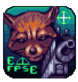
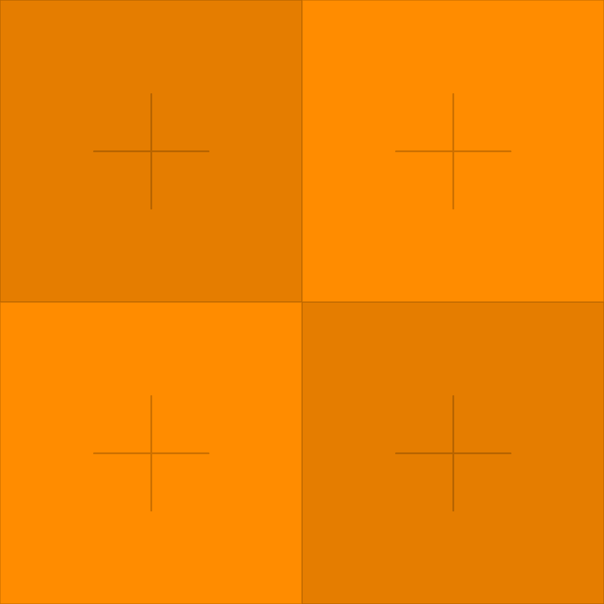
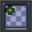
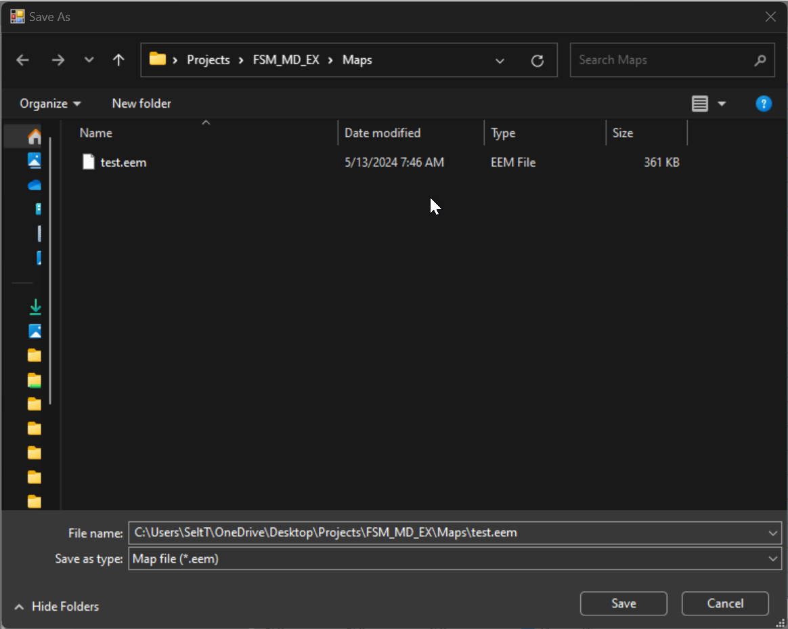
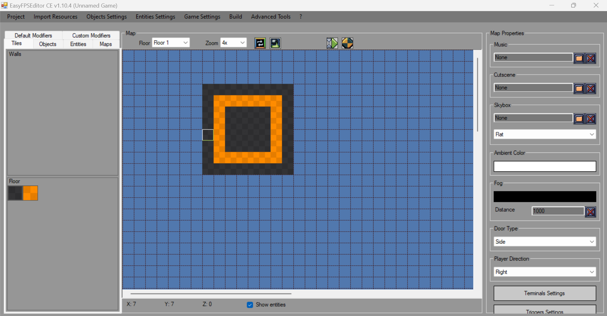
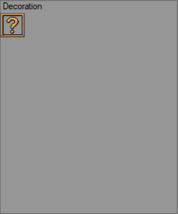
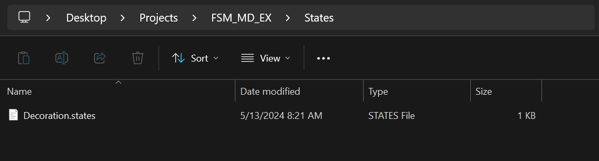
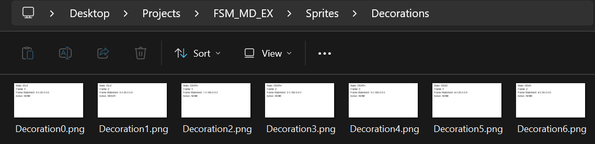

# EFPSE  Finite State Machine tutorial

Welcome to my first tutorial on EFPSE  finite state machines!

Real quick: This document is for users of EFPSE  who can easily do basic engine tasks and want to see what state machines are about. 

The first half is theory skip this if you know what a state machine is, or don't care, and then start at [Creating a State Machine in EFPSE ](#how-do-you-create-a-state-machine-in-efpse-1104) .

And if you're really impatient jump to th [Second half (implementation and application of blah blah)](#second-half-implementation-and-application-of-blah-blah) to get an extremely simple state machine in EFPSE  with only a few steps(minutes).


Otherwise keep reading and enjoy the rest of the tutorial.:)
## Intro

### Who is this document for?

Users of EFPSE  that are somewhat familiar with the software. IE: You should know how to navigate EFPSE , add textures, create new maps and do other simple tasks.

### What are the assumptions?

I assume you know what a computer is and that's pretty much it.

### In what way will this material be Presented?
> "Wisdom comes from understanding simple things deeply" - Twain maybe

I have no pedagogic background except tutoring in college. 

My aim is to give you the smallest working model of `Finite State Machines` (theory and implementation) so that you can understand all the moving pieces of EFPSE 's state machines.


### who is the author?

me

### Structure of document

#### First half lecture blah blah
This section has some bare bones theory for those who've never heard of a state machine. It then ends with an explanation of how to create a state machine in EFPSE . 

There are some bonus assignment that can be completed in 1ish minutes just to double check and see if you understand. No tricks, nothing that's not from the material.

#### Second half implementation and application
This will be a step by step, simple FSM implementation in EFPSE .There will be screenshots and videos to help guide you. If you're familiar with the engine this should really only take you 10 ish minutes. 

[--->Go to the second half](#second-half-implementation-and-application-of-blah-blah)

## First half (lecture blah blah)

### What is a finite state machine?
Let's first start by answering this question

> A state machine [🤖] reads a set of [⏰:🕓] inputs and changes to a different state[🚦:🟥,🟨,🟩] based on those inputs.

Ok, but what does that quote really mean?

If you've never heard of a finite state machine before you may picture some kind of robot that's... finite? Let's try to see if we can fill in some more details of this finite fuzzy robo we're photoing in our mind. In fact they don't even need to be a robot at all!

Really all we need is a pencil and paper but since this is a computer I'll make a little diagram.


So we draw two circles that represent two different `states` and we draw an arrow between them to represent the `input` . The text over the arrow that reads `Go to STATE B`, that's our `input` or our `action`. If we give that `input` or `action` to our machine, then our state machine will transition *from* `STATE A` *to* `STATE B`.

### Huh? Break it down for me

It can be kind of hard to see what's going on in a diagram like this so let's break it down into three steps.

In the very zeroth step we have our machine represented by this little box in `STATE A`

#### 

Now we give our machine the signal to go to `STATE B`


And upon receiving this signal the machine will change the `STATE B` and that's where it will stay


OK admittedly that was kind of abstract, so let's look at some real world examples that we've already interacted with.

### Everyday examples

That's right, you've interacted with state machines plenty of times. And probably even multiple times today!

Let's go over three in a little detail:
-   Light switches (🔛:💡,📴:⬛)
-   Traffic lights (🚦:🟥,🟨,🟩)
-   Brushing teeth (🤔)

### A closer look (👀)

#### At light switches:


{width="350"}

A light switch is a perfect example of a state machine. 

There are two states: `OFF` and `ON`. 

The `signal` is the light switch. 
<br>

<style>
    .switch {
        position: relative;
        display: inline-block;
        width: 60px;
        height: 34px;
    }

    .switch input {
        opacity: 0;
        width: 0;
        height: 0;
    }

    .slider {
        position: absolute;
        cursor: pointer;
        top: 0;
        left: 0;
        right: 0;
        bottom: 0;
        background-color: #ccc;
        -webkit-transition: .4s;
        transition: .4s;
    }

    .slider:before {
        position: absolute;
        content: "";
        height: 26px;
        width: 26px;
        left: 4px;
        bottom: 4px;
        background-color: white;
        -webkit-transition: .4s;
        transition: .4s;
    }

    input:checked+.slider {
        background-color: #2196F3;
    }

    input:focus+.slider {
        box-shadow: 0 0 1px #2196F3;
    }

    input:checked+.slider:before {
        -webkit-transform: translateX(26px);
        -ms-transform: translateX(26px);
        transform: translateX(26px);
    }

    input:checked+.slider:after {

        content: '☀️';
        color: white;
        display: block;
        position: absolute;
        transform: translate(250%, -55%);
        top: 50%;
        right: 55px;
        font-size: 30px;
    }

    input:not(:checked)+.slider:after {
        content: '🌙';
        color: white;
        display: block;
        position: absolute;
        transform: translate(250%, -55%);
        top: 50%;
        right: 55px;
        font-size: 30px;
    }

    /* Rounded sliders */
    .slider.round {
        border-radius: 34px;
    }

    .slider.round:before {
        border-radius: 50%;
    }
</style>

<label class="switch">
    <input type="checkbox" checked>
    <span class="slider"></span>
</label>

<br>
<small>Try switching the light ☀️: on and 🌙: off</small>
<br>
<br>
 This simple state machine has two states and has two actions. Nothing unknown can happen you could say it's very...finite.


#### At traffic lights:

{fig-alt="Traffic light diagram explaining how as the timer expires the traffic light transitions from green to amber to red and emback the green" fig-align="left"}

Traffic lights are another perfect example of state machines that we interact with every day. Instead of two states like the light switch there's three. And instead of a switch you use with your finger, the traffic lights use timers, pressure sensors, and other signals to determine when to go to the next state.

##### Traffic lights simulation (🚦:🟥,🟨,🟩)
Let's take a look at a simulation below (because I made it 🤓). If you click on <span style="background-color:#2E2F3C !important;color:white;padding:12px;padding-left:10px;padding-right:16px; border-radius: 3px;">▶️  Simulate</span>
**in the bottom right of the embedded window**, You will enter into simulation mode. From here you can click on <span style="background-color:#2949A5 !important;color:white;padding:6px;padding-left:10px;padding-right:10px; border-radius: 14px;">20s</span> to simulate <code>20 seconds</code> going off and moving to the next state: <span style="background-color:#4D4F5F !important;color:white;padding:6px;padding-left:10px;padding-right:10px; border-radius: 3px;">RED</span>, <span style="background-color:#4D4F5F !important;color:white;padding:6px;padding-left:10px;padding-right:10px; border-radius: 3px;">GREEN</span>, or <span style="background-color:#4D4F5F !important;color:white;padding:6px;padding-left:10px;padding-right:10px; border-radius: 3px;">YELLOW</span>
.
<iframe src="https://stately.ai/registry/editor/embed/f7a50bc1-d70b-4133-823c-4f7370e0ea70?machineId=8757d2cb-9c54-48be-a3f9-651bcd921054" width="90%" height="400px" frameborder="0">
https://stately.ai/registry/editor/&mode=design
</iframe>

<span style="color:grey">NOTE: The embedded window behaves kind of funny with the scroll wheel so if you end up losing the traffic light state machine you can use the middle click to drag the content back into center. Sorry.😅</span>


#### Brushing Teeth <span style="color:grey">... (🤔)?</span>

{width="500"}

Yes even brushing your teeth can be conceptualized as a state machine!

Why anyone would do that <span style="color:grey"> (for the tutorial! 🤓)</span> is any other one's guess but the point is that **_finite state machines_ don't have to just be _mechanical_ or _electronic_ things**. **As long as you have a set of** <span style="background-color:#4D4F5F !important;color:white;padding:6px;padding-left:10px;padding-right:10px; border-radius: 3px;">STATES</span> **and a set of** <span style="background-color:#2949A5 !important;color:white;padding:6px;padding-left:10px;padding-right:10px; border-radius: 14px;">inputs</span>**(signals) that are known, _you can conceptualize these states and inputs as a state machine_.**

That's the power of the ~~[keyblade](https://www.youtube.com/watch?v=vY9TLwsL8pQ)~~ state machine! 

You can boil down sophisticated decision making processes or respond to specific events in <em>consistent</em> and <em>reliable</em> ways using logic.

So as you continue with this tutorial <span style="color:grey">( and after 🙏 )</span> try to think about everyday objects that could be broken down into a series of <span style="background-color:#4D4F5F !important;color:white;padding:6px;padding-left:10px;padding-right:10px; border-radius: 3px;">STATES</span> and <span style="background-color:#2949A5 !important;color:white;padding:6px;padding-left:10px;padding-right:10px; border-radius: 14px;">inputs</span>.(Radios, TV's, washing machines, etc...)

### Summary of part one <span style="color:grey">(condensed blah blah ) </span>
In summary:

<b>Finite State machines</b> are conceptual tools used to model systems or processes. These systems are comprised of known <span style="background-color:#4D4F5F !important;color:white;padding:6px;padding-left:10px;padding-right:10px; border-radius: 3px;">STATES</span> and known <span style="background-color:#2949A5 !important;color:white;padding:6px;padding-left:10px;padding-right:10px; border-radius: 14px;">actions</span>  and <span style="background-color:#2949A5 !important;color:white;padding:6px;padding-left:10px;padding-right:10px; border-radius: 14px;">inputs</span>. 

Above all else these system can only ever be in a predefined <span style="background-color:#4D4F5F !important;color:white;padding:6px;padding-left:10px;padding-right:10px; border-radius: 3px;">STATES</span> or take a predefined <span style="background-color:#2949A5 !important;color:white;padding:6px;padding-left:10px;padding-right:10px; border-radius: 14px;">action</span>.

#### Prelude
That is a lot of boring text thanks for bearing with all the prerequisite stuff now we can start using what we know to make state machines inside EFPSE !

<details class="bonus-assignment">
  <summary><span style="color:grey">Bonus assignment</span></summary>
  
  <p>On a piece of paper draw out your own state machine!</p>
  <p>Try to think about something you've interacted with recently that you could break down into a state machine. (States and inputs)</p>
  <p>I made a bunch already but here's one last one</p>
  
  <details class="bonus-assignment">
    <summary><span style="color:grey">answer</span></summary>
    <p>I know I said no tricks but I didn't actually make one 'cause I'm lazy and I already made a bunch! </p>
    </details>
</details>


### How do you create a state machine (In EFPSE 1.10.4)?
<div style="max-width: 250px; padding: 10px; background-color: #DCF8C6; border-radius: 15px; position: relative; margin: 20px;">
    
    <div style="display: flex; align-items: center; margin-left: 22px;">
        <span style="font-size: 14px;">OK finally we're here! Let's make a state machine in EFPSE !
        <br>...<br>...<br>
        But how do we do that?  </span>
    </div>
    <div style="position: absolute; top: 50%; left: -15px; border-style: solid; border-width: 8px 15px 8px 0; border-color: transparent #DCF8C6 transparent transparent; content: '';"></div>
</div>

<div style="max-width: 250px; padding: 10px; background-color: #DCF8C6; border-radius: 15px; position: relative; margin: 20px;">
    <div style="display: flex; align-items: center;">
        <span style="font-size: 14px;">Thankfully the <a href="https://pixelwolf.net/efpse/wiki/index.php?title=Main_Page">wiki</a>  has an example of a <a href="https://pixelwolf.net/efpse/wiki/index.php?title=FSM#Basic_FSM_for_decorations:">simple state machine for a decoration</a>. So we'll build an example based off that with some of our own twists! And we'll do it step by step and analyze every single component starting with how to describe our state machine in EFPSE .</span>
    </div>
    <div style="position: absolute; top: 50%; right: -15px; border-style: solid; border-width: 8px 0 8px 15px; border-color: transparent transparent transparent #DCF8C6; content: '';"></div>
    
</div>


#### Overview
Within the EFPSE  game engine, state machines are used for three different components. 
<!-- These really should be diagrams in a table -->
Weapons 🔫, decorations 🪑, and enemies 🦹. 

With these state machines we can display frames of animation, play sounds, emit two different kinds of particles, set and read variables, do simple calculations, and jump to different states; conditionaly or otherwise.  
(And probably a whole bunch of stuff I've never even thought of...)

But in this specific tutorial we'll just take a look at basic functionality for the basic decoration state machine.

In EFPSE , state machines are described declaratively in a script-like language saved in a text file with the extension `.states`. These state scripts should be located in the <span style="color:#0070C1;cursor:help" title="📁C:\Users\<user>\OneDrive\Desktop\Projects\Project\States">📂Project/States</span> folder.


<details class="bonus-assignment">
  <summary><span style="color:grey">Can't find the folder?</span></summary>
  <p>The folder is wherever EFPSE > saves it's projects. I'm pretty sure by default that located in the same directory as the EFPSE >  executable `.exe`. I run mine on my desktop so on my desktop there is a folder called 📁Projects that contains examples of the folder's namesakes. Here's the full path:</p>
  <p>📂C:\Users\User\OneDrive\Desktop\Projects\FSMTUT01</p>
  <p>and an image of the inside of the 📂Project/ folder</p>
  
</details>

##### EXAMPLE
Let's take a look at an example of a script that would be located in the `States`' directory:


<span style="color:#0070C1;cursor:help" title="📁C:\Users\<user>\OneDrive\Desktop\Projects\Project\States\Decoration.states">📂Project/States/Decoration.states</span>

``` states
image Decoration 0 6

state IDLE NONE 0
frame 0 0.25 0 0 0 NONE
frame 1 0.25 0 0 0 READY

state DEATH DEAD 0
frame 2 0.166 0 0 0 NONE
frame 3 0.166 0 0 0 NONE
frame 4 0.166 0 0 0 NONE

state DEAD NONE 0
frame 5 0.25 0 0 0 NONE
frame 6 0.25 0 0 0 NONE
```


#### Syntax

Let's break this down by taking a look at each line and identify what's going on.

##### Resource declarations

`image Decoration 0 6`

All resource declarations need to be done at the top of the file. This can include `image`s using the `image` keyword or `sound`s using the `sound` keyword (which may be covered later). 

##### State declarations

`state IDLE NONE 0`

Each `state` definition is preceded by the keyword `state` then followed by the `NAME` of the `state` you would like to define followed by the `NAME` of the `state` you would like to come after. The end of this line *requires* a `0` and this is an interpolation flag for 3D models.

~~That is correct you can use 3D models but we will not be covering that in this tutorial.~~

##### Frame declarations

``` state
state IDLE NONE 0
frame 0 0.25 0 0 0 NONE
frame 1 0.25 0 0 0 READY
```

Each line of the `state` begins with the keyword `frame` followed by the frame number (`0`) followed by duration the frame will be displayed (`0.25`), followed by XYZ offsets for weapons (`0 0 0`), followed by an action where default is the keyword `NONE`

Let's take an even closer look at one of these `frame` declarations.

| <span style="background-color: rgb(102, 102, 102);">**Frame keyword**</span> | <span style="background-color: aqua;">**Frame index**</span> | <span style="background-color:orange;">**Duration on screen**</span> | <span style="background-color:salmon;">**XYZ offsets (only for weapons)**</span> | <span style="background-color:yellowgreen;">**Action to take**</span> |
| ---------------------------------------------------------------------------- | ------------------------------------------------------------ | -------------------------------------------------------------------- | -------------------------------------------------------------------------------- | --------------------------------------------------------------------- |
| `frame`                                                                      | `0`                                                          | `0.25`                                                               | `0 0 0`                                                                          | `READY`                                                               |

<span style="background-color: rgb(102, 102, 102);">**Frame keyword**</span> - Frame keyword used on every line of a frame in a state's definition

<span style="background-color: aqua;">**Frame index**</span> - The index of the list of images that have been loaded to display

<span style="background-color:orange;">**Duration on screen**</span> - This is the length in <code>seconds</code> of how long to display the image for

<span style="background-color:salmon;">**XYZ offsets (only for weapons)**</span> - This is an XYZ offset used for weapons, allows for on screen position adjustment

<span style="background-color:yellowgreen;">**Action to take**</span> - The action to perform on this frame. Default is <code>NONE</code> and will do nothing.\*\*

> \*\*Here we're Performing the <code>READY</code> action. This action is only necessary to be called before a *weapon* or *enemy* can attack. In this case we're using only a *decoration* and the *decoration* entity does not support the attack state so essentially this does nothing

#### Whoa that's a lot! 😱
Absolutely! No worries if it doesn't sink in the first time. 

Let's back it way back up and look at the original code but let's remove all those messy `frame` declarations and let's look at the `state` declaration syntax:


📂Project/States/Decoration.states
<span  style="color:grey;">`frame` declarations omitted</span>

``` states
image Decoration 0 4

state IDLE NONE 0

state DEATH DEAD 0

state DEAD NONE 0
```
Now let's compare that to a diagram of what's going on;

🤖`Decoration` state machine diagram
{width="650"}

As we can see both the script and the diagram have three states which are idle death and dead, But what's not included in the script is a <span style="color: transparent; background-image: linear-gradient(to right, black, #f0f0f0); -webkit-background-clip: text; background-clip: text; text-fill-color: transparent;">hidden signal...🥷</span>

In EFPSE Things that have HP  like breakable decorations, enemies ,and the player  are hard coded to do certain things and one of them is to always check if their HP   is above `0`. 

If this happens the state machine stops what it's doing immediately and it goes to the `DEATH` state.
>This happens no matter what state the entity is in. This includes any custom states that you have defined as well. 

From here we can control what it does but most commonly we transition to the `DEAD` state where... nothing happens.

<!-- To do put the picture of the decoration option -->
I'm pretty sure the state doesn't even loop. And inside the decoration options if you click the check box 


the entity will be removed In the `DEAD` state.


##### Back a bit deeper
Now let's dive back in just a little bit deeper and look at the simulation that I have prepared. It works just like the stoplight simulation but this time I've made it so that it mirrors our decoration state machine.

Inside the states there are mockups of what happens inside EFPSE's state machine. They are only for demonstration purposes. The intention here is to convey that when the state machine is in a specific state it executes each frame while in that state until it goes to another state.
<iframe src="https://stately.ai/registry/editor/embed/f7a50bc1-d70b-4133-823c-4f7370e0ea70?machineId=94fa47ad-0e4b-461c-8865-4e04f15a520d" width="90%" height="400px" frameborder="0">
https://stately.ai/registry/editor/&mode=design
</iframe>

It might be a little bit hard to see this time around because when the `if` statement is true it looks like nothing happens. You can click on the view in Stately studio button and run the simulation there and you'll get more feedback or if you're lazy I put a video below that shows me doing that so you don't have to do it yourself. 🙏

<video controls width="720">
  <source src="DecorationSim.mp4" type="video/mp4">
  Your browser does not support the video tag.
</video>


<details class="bonus-assignment">
  <summary><span style="color:grey">Bonus assignment 2</span></summary>
<code>
image Decoration 0 4

state IDLE NONE 0
frame 0 0.25 0 0 0 NONE
frame 0 0.25 0 0 0 READY

state DEATH DEAD 0
frame 1 0.166 0 0 0 NONE
frame 2 0.166 0 0 0 NONE
frame 3 0.166 0 0 0 NONE

state DEAD NONE 0
frame 4 0.25 0 0 0 NONE
frame 4 0.25 0 0 0 NONE
</code>
  <p>Consider the script that we're working with. Take a step back and try Translating it into your native tongue.Don't worry about whether it's wrong or whether it's right! :) I find solidifying my thoughts into words helps me learn. Maybe it can help you too?</p>
  <p></p>
  <p></p>
  
  
  <details class="bonus-assignment">
    <summary><span style="color:grey">answer</span></summary>
    <p>There's no really wrong or right answer but here's mine:</p>
    <p>Make a state machine that loads four Images named decoration. Then Define three states idle death and dead. Transition from death to dead otherwise loop infinitely in the idle state.</p>
    </details>
</details>

#### Translating it into English with 🤖EFPSE GPT
<span style="color:grey">NOTE: this is a joke.This GPT does not exist. (Yet maybe)</span>   
If you're still I'm not sure exactly what's going on in the Script or you enjoy things being talked about until they're no longer interesting, let's translate the script into English below.

Otherwise, feel free to skip this and move on directly to [Second half (implementation and application of blah blah)](#second-half-implementation-and-application-of-blah-blah)
.


<div style="font-family: Arial, sans-serif; background-color: #f2f2f2; color: #333; margin: 0; padding: 0;">
    <div class="chat-container" style="max-width: 100%; margin: 20px auto; border-radius: 8px; overflow: hidden; box-shadow: 0 0 10px rgba(0, 0, 0, 0.1);">
        <ul class="chat" style="list-style: none; margin: 0; padding: 0;">
            <li class="user-message" style="padding: 8px 16px; border-bottom: 1px solid #ccc;">
                <span class="sender-name" style="font-weight: bold; color: #555;">🐖Cleverhog:</span>
                <p class="message" style="margin-top: 4px; font-size: 16px;">
                <code>
                <br>
image Decoration 0 6

state IDLE NONE 0
frame 0 0.25 0 0 0 NONE
frame 1 0.25 0 0 0 READY

state DEATH DEAD 0
frame 2 0.166 0 0 0 NONE
frame 3 0.166 0 0 0 NONE
frame 4 0.166 0 0 0 NONE

state DEAD NONE 0
frame 5 0.25 0 0 0 NONE
frame 6 0.25 0 0 0 NONE
                </code>
                Hi, I need some help Reading this state script for EFPSE.Can you please help me Read it line by line?</p>
                </p>
            </li>
            <li class="bot-message" style="padding: 8px 16px; border-bottom: 1px solid #ccc;">
                <span class="sender-name" style="font-weight: bold; color: #555;">🤖EFPSE GPT:</span>
                <p class="message" style="margin-top: 4px; font-size: 16px;">Absolutely! Which line would you like to start at?</p>
            </li>
            <li class="user-message" style="padding: 8px 16px; border-bottom: 1px solid #ccc;">
                <span class="sender-name" style="font-weight: bold; color: #555;">🐖Cleverhog:</span>
                <p class="message" style="margin-top: 4px; font-size: 16px;"><code>image Decoration 0 6</code>
                 <p>This one please. What does this line say?</p>
                </p>
            </li>
            <li class="bot-message" style="padding: 8px 16px; border-bottom: 1px solid #ccc;">
                <span class="sender-name" style="font-weight: bold; color: #555;">🤖EFPSE GPT:</span>
                <p class="message" style="margin-top: 4px; font-size: 16px;">This script says to load an <code>image</code> called <code>Decoration</code> frames <code>0</code> through <code>6</code>.</p>
            </li>
            <li class="user-message" style="padding: 8px 16px; border-bottom: 1px solid #ccc;">
                <span class="sender-name" style="font-weight: bold; color: #555;">🐖Cleverhog:</span>
                <p class="message" style="margin-top: 4px; font-size: 16px;">
                <code>state IDLE NONE 0<br>
                    frame 0 0.25 0 0 0 NONE<br>
                    frame 1 0.25 0 0 0 READY</code> 
                    <br>
                    <p>-</p>
                    <p>And this part? </p>
                    </p>
            </li>
            <li class="bot-message" style="padding: 8px 16px; border-bottom: 1px solid #ccc;">
                <span class="sender-name" style="font-weight: bold; color: #555;">🤖EFPSE GPT:</span>
                <p class="message" style="margin-top: 4px; font-size: 16px;">Make a state called <code>IDLE</code> that repeats with two <code>frame</code>s where they're the <code>0th</code> and <code>1st</code> image from the <code>Decoration</code> <code>image</code> list and they both last <code>0.25</code> seconds; set the last <code>frame</code>'s action to be <code>READY</code>. Because <code>NONE</code> is set as the <em>transition state</em>, loop <u>indefinitely</u>♾️</p>
            </li>
            <li class="user-message" style="padding: 8px 16px; border-bottom: 1px solid #ccc;">
                <span class="sender-name" style="font-weight: bold; color: #555;">🐖Cleverhog:</span>
                <p class="message" style="margin-top: 4px; font-size: 16px;">
                <code>
                    <br>
                    state DEATH DEAD 0<br  >
                    frame 2 0.166 0 0 0 NONE<br>
                    frame 3 0.166 0 0 0 NONE<br>
                    frame 4 0.166 0 0 0 NONE<br>
                </code>
                <p>What about all this garbage?</p>
                </p>
            </li>
            <li class="bot-message" style="padding: 8px 16px; border-bottom: 1px solid #ccc;">
                <span class="sender-name" style="font-weight: bold; color: #555;">🤖EFPSE GPT:</span>
                <p class="message" style="margin-top: 4px; font-size: 16px;">
                Make a state called <code>DEATH</code> that transitions into the <code>DEAD</code> state. Make the state have three frames starting at <code>2</code> ending at <code>4</code>, and make each of them last for  <code>0.166</code> seconds. Do not invoke any actions in this state.
                </p>
            </li>
            <li class="user-message" style="padding: 8px 16px; border-bottom: 1px solid #ccc;">
                <span class="sender-name" style="font-weight: bold; color: #555;">🐖Cleverhog:</span>
                <p class="message" style="margin-top: 4px; font-size: 16px;">
                <code>
                <br >
                state DEAD NONE 0<br >
                frame 5 0.25 0 0 0 NONE<br >
                frame 6 0.25 0 0 0 NONE<br >
                </code>
                <p>And the very last state?</p>
                </p>
            </li>
            <li class="bot-message" style="padding: 8px 16px; border-bottom: 1px solid #ccc;">
                <span class="sender-name" style="font-weight: bold; color: #555;">🤖EFPSE GPT:</span>
                <p class="message" style="margin-top: 4px; font-size: 16px;">
                Define a state called <code>DEAD</code> that loops forever. There will be two frames; the <code>5</code>th and <code>6</code>th image from the decoration list.
                <br>
                <br>Display both of them for <code>0.25</code> seconds. Do not perform any actions in this state
                </p>
            </li>
            <li class="user-message" style="padding: 8px 16px; border-bottom: 1px solid #ccc;">
                <span class="sender-name" style="font-weight: bold; color: #555;">🐖Cleverhog:</span>
                <p class="message" style="margin-top: 4px; font-size: 16px;">
                OK! So this state script creates a decoration with four frames, three states;<code>IDLE</code>,<code>DEATH</code>, and <code>DEAD</code>. 
                <p></p>
                </p>
            </li>
            <li class="bot-message" style="padding: 8px 16px; border-bottom: 1px solid #ccc;">
                <span class="sender-name" style="font-weight: bold; color: #555;">🤖EFPSE GPT:</span>
                <p class="message" style="margin-top: 4px; font-size: 16px;">Yes that's perfect! You sound like you're getting the hang of this. 
                </p>
            </li>
            <li class="user-message" style="padding: 8px 16px; border-bottom: 1px solid #ccc;">
                <span class="sender-name" style="font-weight: bold; color: #555;">🐖Cleverhog:</span>
                <p class="message" style="margin-top: 4px; font-size: 16px;">
                Alright, but how does the state machine know how to go to the <code>DEATH</code> state if the <code>IDLE</code> state loops indefinitely?
                </p>
            </li>
            <li class="bot-message" style="padding: 8px 16px; border-bottom: 1px solid #ccc;">
                <span class="sender-name" style="font-weight: bold; color: #555;">🤖EFPSE GPT:</span>
                <p class="message" style="margin-top: 4px; font-size: 16px;">Great question!<br> <br>The state machine checks continuously if the decoration is above 0HP . If at any point their HP  falls to <code>0</code>, it will transition into the <code>DEATH</code> state and then, commonly in practice, transitions to the <code>DEAD</code> state.
                </p>
            </li>
            <li class="user-message" style="padding: 8px 16px; border-bottom: 1px solid #ccc;">
                <span class="sender-name" style="font-weight: bold; color: #555;">🐖Cleverhog:</span>
                <p class="message" style="margin-top: 4px; font-size: 16px;">
                Awesome thanks for all the help!
                </p>
            </li>
            <li class="bot-message" style="padding: 8px 16px; border-bottom: 1px solid #ccc;">
                <span class="sender-name" style="font-weight: bold; color: #555;">🤖EFPSE GPT:</span>
                <p class="message" style="margin-top: 4px; font-size: 16px;">You're absolutely welcome! If you have anymore questions the <a href="https://discord.gg/ATaVGt9YQ9">EFPSE Discord</a> might be a wonderful place to ask.
                <br> Or, if you're feeling bookwormy 🪱📖, Head over to the EFPSE <a href="https://pixelwolf.net/efpse/wiki/index.php?title=Main_Page">Wikipedia</a> run by: <a href="https://pixelwolf.net/">  Pixel Wolf</a>
                </p>
            </li>
            <!-- Add more messages here -->
        </ul>
    </div>
    <div style="width: 100%; padding: 16px; background-color: #fff; border-top: 1px solid #ccc;">
        <input type="text" style="width: calc(100% - 32px); padding: 8px; border: 1px solid #ccc; border-radius: 4px; box-sizing: border-box;" placeholder="Type your message here...(This doesn't actually work 😅)"><button style="height:28">Submit</button>
    </div>
</div>

## Second half (implementation and application of blah blah)

OK let's open up EFPSE  And create a new project.


<br>

Now we're going to import some prototype textures from <a href="https://kenney-assets.itch.io/prototype-textures">Kenny's prototype textures pack</a> and add them to our map. Specifically these textures. 
🖼️<code>Dark/texture_09.png</code>

🖼️<code>Orange/texture_10.png</code>

(Just download and use these if you don't want to get the whole pack)


Now create a new map  called <code>test</code> and add the <code>Dark</code> and <code>Orange</code> textures to it.

#### New map dialog box


#### Map done


#### Adding the decoration
Add the decoration like we normally would:


We can leave the settings at default.


And the resulting decoration list should look like this:




#### Saving the state script
OK up until now we've done things that we all know how to do let's do some things that we might not have done before.

Let's take that decoration script that we were working on and save it in 📁`Projects\FSM_MD_EX\States`

``` states
image Decoration 0 6

state IDLE NONE 0
frame 0 0.25 0 0 0 NONE
frame 1 0.25 0 0 0 READY

state DEATH DEAD 0
frame 2 0.166 0 0 0 NONE
frame 3 0.166 0 0 0 NONE
frame 4 0.166 0 0 0 NONE

state DEAD NONE 0
frame 5 0.25 0 0 0 NONE
frame 6 0.25 0 0 0 NONE
```

You should copy <a href="tut_files/Decoration.states">Decoration.states</a> into the States directory of your project.



But as you know decorations need images otherwise they're just going to be invisible entities in the game. 

Don't worry! 

I prepared for that by creating this tool that allows us to make simple debug images for **any** state machine in EFPSE using the EFPSE state machine syntax!

### Creating our images
<h4>Image Generator</h4>

<p>This application will take in a state's file from EFPSE  and generate an image for each frame.</p>
All we need to do is give it an input script ⬇️📝 

```
image Decoration 0 6

state IDLE NONE 0
frame 0 0.25 0 0 0 NONE
frame 1 0.25 0 0 0 READY

state DEATH DEAD 0
frame 2 0.166 0 0 0 NONE
frame 3 0.166 0 0 0 NONE
frame 4 0.166 0 0 0 NONE

state DEAD NONE 0
frame 5 0.25 0 0 0 NONE
frame 6 0.25 0 0 0 NONE
```


And it will give us back a link that will let us download a zip file that contains all of our generated images. You can see an example of how this looks like to the right.


<span>⬇️📁</span>

<!-- LList of image names-->
<!-- Styles for the image container -->
<style>
    .container {
        display: flex;
        justify-content: space-between;
        align-items: flex-start;
        margin: 20px;
    }
    .left-column {
        width: 45%;
    }
    .right-column {
        width: 45%;
    }
    #imageGrid {
        display: grid;
        grid-template-columns: repeat(3, 1fr);
        grid-gap: 10px;
    }
    .image-item {
        width: 100%;
        height: auto;
        border-radius: 5px;
        box-shadow: 0 0 5px rgba(0, 0, 0, 0.3);
    }
</style>
<div class="container">
    <div class="left-column">
        <h4>OUTPUT</h4>
        <code>images.zip</code>
        <ul id="imageList">
            <li>🖼️ Decoration0.png</li>
            <li>🖼️ Decoration1.png</li>
            <li>🖼️ Decoration2.png</li>
            <li>🖼️ Decoration3.png</li>
            <li>🖼️ Decoration4.png</li>
            <li>🖼️ Decoration5.png</li>
            <li>🖼️ Decoration6.png</li>
        </ul>
    </div>
    <span>➡️🖼️</span>
    <div class="right-column">
        <h4>Images</h4>
        <div id="imageGrid">
            <!-- Example images -->
            
            
            
            
            
            
            
        </div>
    </div>
</div>

<p>Paste your script here:</p>
<textarea id="scriptInput" rows="20" cols="50" placeholder="Paste your script here..."></textarea><br>
<button onclick="generateImages()">Generate Images</button><br><br>

<p>Once you click this button a link will appear below and you can click on that link to download a zip file named <code>📁images.zip</code> that contains your debug images</p>
<a id="downloadLink" style="display: none;">Download Images</a>
<script src="https://cdnjs.cloudflare.com/ajax/libs/jszip/3.7.1/jszip.min.js"></script>
<script>
    function generateImages() {
        const scriptContent = document.getElementById('scriptInput').value.trim();
        const scriptLines = scriptContent.split('\n');
        let frameCounters = {};
        let imageName = '';
        let stateName = '';
        let imageCounter = 0;
        let fn = 0
        let zip = new JSZip();
        let imageFound = false; // Flag to track if an image has been found
        scriptLines.forEach((line, index) => {
            const parts = line.split(' ');
            console.log(parts);
            if (parts[0] === "state") {
                stateName = parts[1];
                fn = 0
            }
            if (parts[0] === 'image' && !imageFound) {
                imageName = parts.slice(1)[0];
                console.log(imageName);
                frameCounters[imageName] = 0;
                imageCounter++;
                imageFound = true; // Set the flag to true after finding the first image
            } else if (parts[0] === 'frame' && imageFound) {
                const frameNumber = frameCounters[imageName]++;
                fn++
                const frameStatement = parts.slice(1, 6).join(' ');
                const action = parts.slice(6).join(' ');
                console.log("action: ", action);
                // console.log(frameStatement);
                // const stateName = parts[parts.length - 1];
                const text = `State: ${stateName}\nFrame: ${fn}\nFrame Statement: ${frameStatement}\nAction: ${action}`;
                // const text = `${stateName}\n${fn}\n${frameStatement}\n${action}`;
                const imageNameWithNumber = `${imageName}${frameNumber}`;
                console.log(text);
                createImage(text, imageNameWithNumber, zip);
            }
        });
        zip.generateAsync({ type: "blob" })
            .then(function (content) {
                const downloadLink = document.getElementById('downloadLink');
                downloadLink.href = window.URL.createObjectURL(content);
                downloadLink.download = 'images.zip';
                downloadLink.style.display = 'inline';
            });
    }
    function createImage(text, imageName, zip) {
        const canvas = document.createElement('canvas');
        const ctx = canvas.getContext('2d');
        canvas.width = 400;
        canvas.height = 200;
        ctx.fillStyle = 'white';
        ctx.fillRect(0, 0, canvas.width, canvas.height);
        ctx.fillStyle = 'black';
        ctx.font = '14px Arial';
        const lines = text.split('\n');
        lines.forEach((line, index) => {
            ctx.fillText(line, 10, 20 + index * 20);
        });
        const dataURL = canvas.toDataURL('image/png').split(',')[1];
        zip.file(`${imageName}.png`, dataURL, { base64: true });
    }
</script>

>Feel free to give me feedback on the tool!

OK so now all we have to do is extract all those images to the

📁`Projects\FSM_MD_EX\Sprites\Decorations`

folder.

>NOTE: Sometimes EFPSE can crash when you're replacing files that have already been set in the editor. So if you run into this issue, just restart EFPSE and try again. It should work fine.

If everything went fine, you should be able to see your debug images in the folder.


####  Adding the player and the decoration to the map

So this is also something we've done so I'll just give you an image of what it looks like Inside the editor:


### Testing it out
Alright so without further ado let's click on test  the game!

<video controls width="720">
  <source src="tut_files\Decoration_demo.mp4" type="video/mp4">
  Your browser does not support the video tag.
</video>

<br>
<br>
And there we have it! Our very first state machine inside EFPSE !!!🥳

### Summary
Give yourself a pat on the back that was a lot!

Here's the <a href="tut_files/FSM_MD_EX.zip"> FSM_MD_EX source code</a> for the project in case you want to look at it.


### What next?
The next thing one might wanna do is put a gun in shoot the machine and watch it die

### Bonus assignments!

<details class="bonus-assignment">
  <summary><span style="color:grey">Bonus assignment 1 :Add in a sound</span></summary>
  
  <p>Your first assignment should be easy</p>
  <p>With this one you don't even have to change any of the frames either we just gotta add some sound.</p>
  <p>Here's what the wiki says about sounds for finite state machines:</p>
  <p>
  <code>sound WeaponFire </code> - will load a sound and add it to a list. They are numbered from 0. Sounds must be placed in Data/Sounds. 
  </p>
  
  <details class="bonus-assignment">
    <summary><span style="color:grey">answer</span></summary>
    <p>I know I said no tricks but I didn't actually make one 'cause I'm lazy and I already made a bunch! </p>
    </details>
</details>